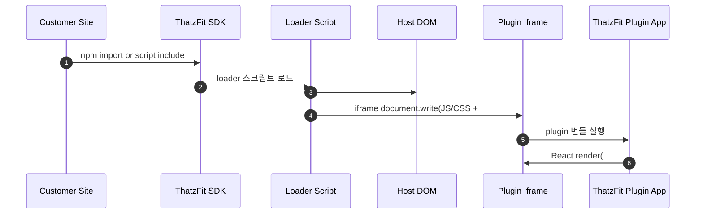
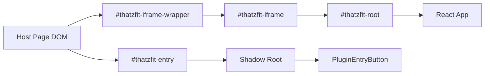
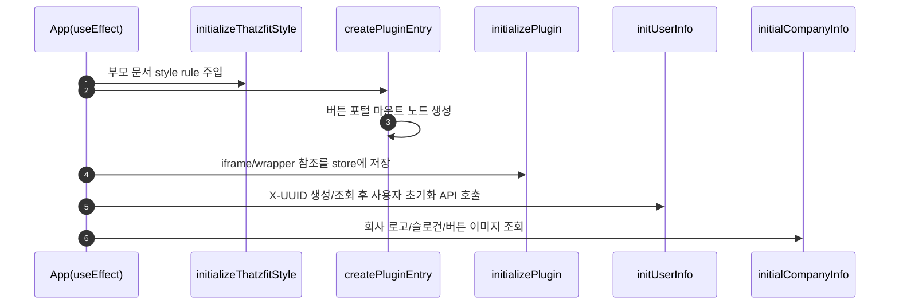
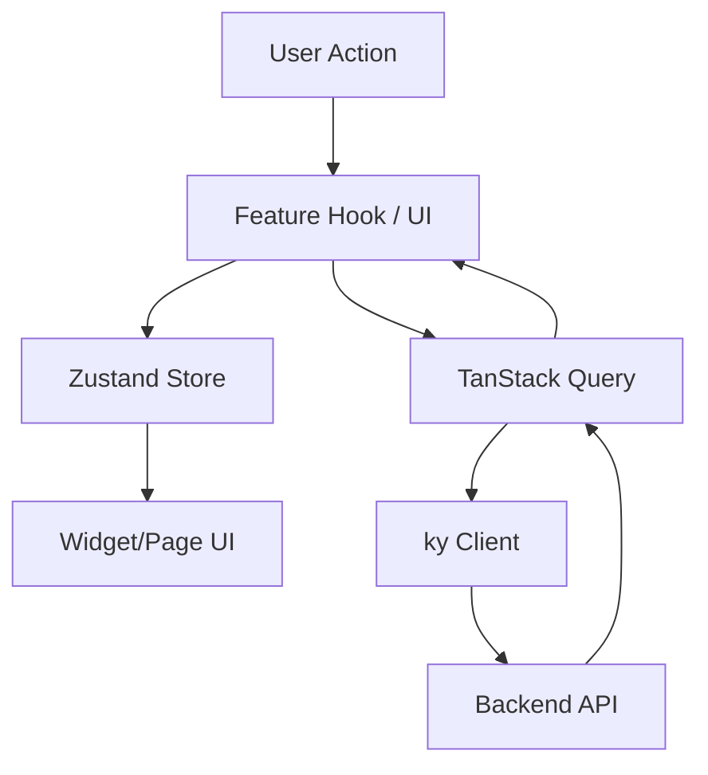

# Project Architecture

ThatzFit 가상 피팅 플러그인 FE 아키텍처 문서입니다.

## 0. End-to-End 로딩 플로우 (고객사 관점)

배포 구조는 "SDK 본체 + loader + plugin 번들"로 분리되어 있습니다.

1. 고객사 사이트에서 ThatzFit SDK를 `npm` 또는 `<script>`로 로드
2. SDK가 loader 스크립트를 로드
3. loader가 호스트 DOM에 `#thatzfit-plugin`, `#thatzfit-entry`, `#thatzfit-iframe-wrapper`, `#thatzfit-iframe`를 생성
4. loader가 iframe 문서에 plugin JS/CSS 번들을 주입
5. plugin 앱이 iframe 내부 `#thatzfit-root`에 렌더링



## 1. 임베드 구조

이 프로젝트는 호스트 페이지에 다음 두 UI를 분리해 임베드합니다.

- `iframe UI`: 실제 플러그인 본문 화면
- `shadow DOM UI`: 플로팅 진입/종료 버튼



## 2. 초기화 흐름

앱 시작 시 `src/Apps/App.tsx`의 `useEffect`에서 아래 순서로 초기화가 진행됩니다.

1. `initializeThatzfitStyle()`
2. `createPluginEntry()`
3. `initializePlugin()`
4. `initUserInfo()`
5. `initialCompanyInfo()`



## 3. 렌더링 방식

`src/Apps/main.tsx` 기준:

- `development`
  - 현재 문서의 `#thatzfit-iframe`를 찾고
  - iframe 내부 문서의 `#thatzfit-root`에 React 앱을 렌더링
- `production`
  - 현재 문서의 `#thatzfit-root`에 React 앱 렌더링

## 4. 라우팅

플러그인 환경에서는 브라우저 URL과 분리된 라우팅이 필요하므로 `createMemoryRouter`를 사용합니다.

- 구현: `src/Apps/Ui/PluginRouter/PluginRouter.tsx`
- 루트 라우트: `src/Apps/Routes/Root.tsx`
- 플러그인 라우트: `src/Apps/Routes/Plugin.tsx`

## 5. 상태와 데이터 흐름

- 전역 상태: `Zustand`
  - `usePluginStore`: iframe/wrapper ref, open 상태, 회사 브랜딩 데이터
  - `usePluginEntryStore`: shadow DOM 포털 마운트 노드
- 서버 상태: `TanStack Query`
- HTTP 클라이언트: `ky`
  - 사용자 식별 헤더 `X-UUID`를 자동 주입
  - 토큰 저장소는 `window.parent.localStorage`



## 6. FSD 구조

이 프로젝트는 FSD(Feature-Sliced Design) 구조를 따릅니다.

### Layer

- `app`: 앱 초기화, 라우팅, Provider
- `pages`: 라우트 단위 화면
- `widgets`: 페이지 조합 단위 UI 블록
- `features`: 사용자 액션/유즈케이스
- `entities`: 도메인 모델/상태/표현
- `shared`: 공통 리소스

현재 디렉터리:

```text
src
├─ Apps/
├─ Pages/
├─ Widgets/
├─ Features/
├─ Entities/
└─ Shared/
```

### Slice

Slice는 도메인 단위입니다.

- 예: `Fitting`, `FittingModel`, `FittingHistory`, `Plugin`, `PluginEntry`, `User`

### Segment

세그먼트는 역할 단위입니다.

- `api`: API 호출, query, query option
- `config`: 상수, 설정
- `model`: 상태 관리, 커스텀 훅
- `ui`: React 컴포넌트
- `util`: 유틸 함수

## 7. 호스트 페이지 요구사항

플러그인 동작을 위해 부모 문서에 아래 앵커가 필요합니다.

```html
<div id="thatzfit-plugin">
  <div id="thatzfit-entry"></div>
  <div id="thatzfit-iframe-wrapper">
    <iframe
      id="thatzfit-iframe"
      title="thatzfit virtual fitting"
      srcdoc="<!DOCTYPE html><html><body><div id='thatzfit-root'></div></body></html>"
    ></iframe>
  </div>
</div>
```

## 8. 운영 전제

- `window.parent.document`, `window.parent.localStorage`를 사용하므로 호스트와 iframe은 동일 출처(Same Origin)여야 합니다.
- iframe/entry 앵커 ID가 변경되면 초기화 로직이 동작하지 않습니다.

## 9. 현재 개선 과제

### 9.1 FastAPI 전환에 따른 API 명세 대응

- 배경: 백엔드가 FastAPI 기반으로 변경되면서 엔드포인트/응답 스키마/에러 포맷 차이가 발생할 수 있음
- 영향 범위: `src/Entities/**/Api`, `src/Features/**/Api`, DTO 타입(`Type/Dto`), 에러 핸들링
- 대응 방향:
  - OpenAPI 스펙 기준으로 DTO 및 query 로직 동기화
  - 상태 코드/에러 body 표준화에 맞춰 `createCustomError` 처리 보강
  - 주요 플로우(유저 초기화, 회사 정보, 피팅/모델 업로드) 회귀 테스트

### 9.2 Asset Cloudflare 업로드 및 CDN 링크 대응

- 배경: plugin 번들을 Cloudflare CDN에서 서빙하도록 배포 체계 변경
- 영향 범위: loader의 번들 경로 주입 로직(vendor/sdk/style), 환경 변수(`VITE_CDN_HOST`)
- 대응 방향:
  - 빌드 산출물 파일명(manifest) 기반으로 loader 주입 경로 자동화
  - 환경별 CDN host 분리(dev/stage/prod) 및 캐시 전략 정리
  - CDN 장애/캐시 불일치 시 fallback 또는 롤백 경로 준비

### 9.3 캡처 로직 안정화

- 배경: iframe + overlay + 포털 구조에서 캡처 시점/영역/스타일 반영 이슈가 발생할 수 있음
- 추가 이슈: 캡처 대상에 SVG가 포함된 경우 결과 이미지가 깨지거나 일부 요소가 누락될 수 있음
- 영향 범위: 의류 캡처/합성 관련 UI 및 훅, iframe 문서 접근/렌더 타이밍
- 대응 방향:
  - 캡처 대상 영역 고정 및 렌더 완료 시점 동기화(로딩 상태/RAF 기준)
  - SVG 포함 노드의 직렬화/래스터라이즈 처리 또는 대체 렌더 전략 검토
  - 디바이스/브라우저별 캡처 결과 검증(특히 모바일 Safari)
  - 실패 케이스 재시도/사용자 안내 UX 추가
